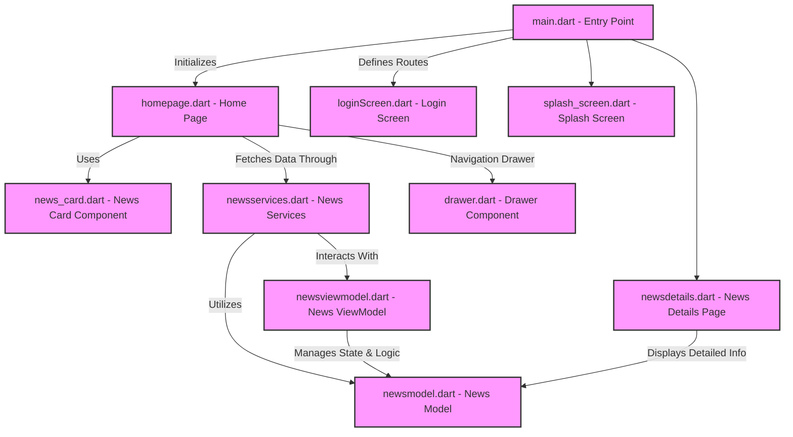
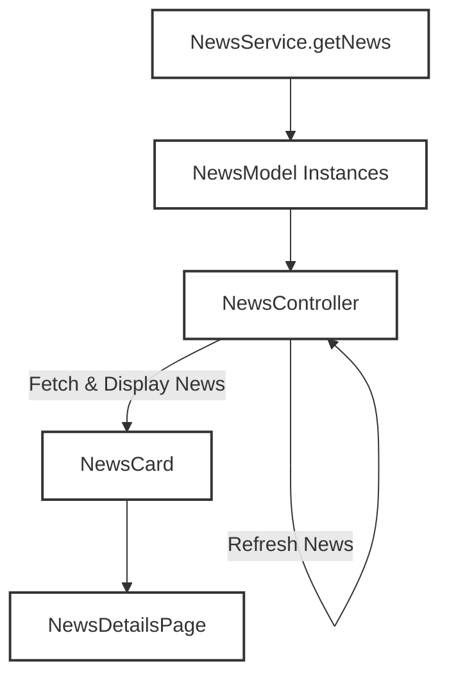
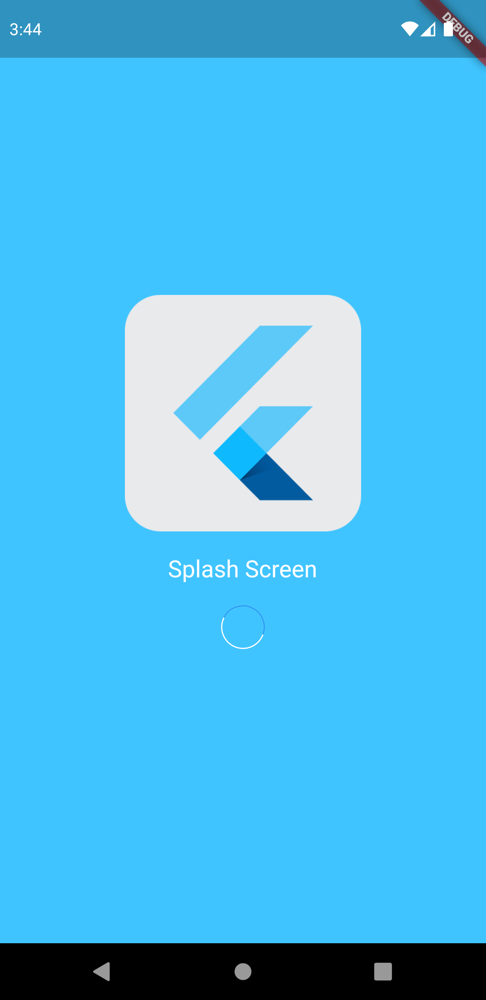
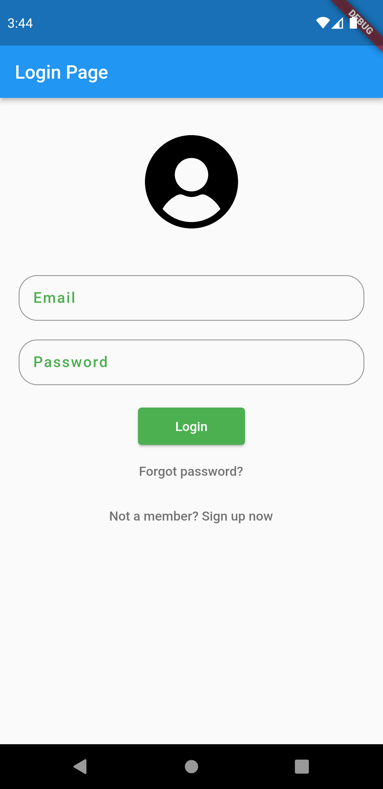
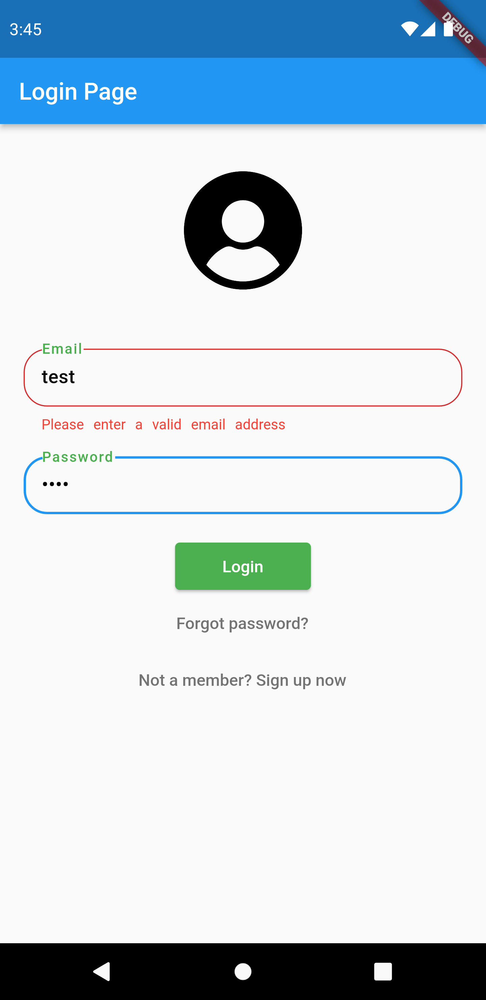
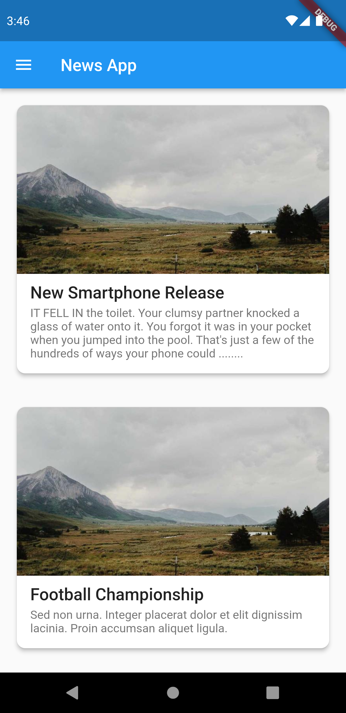

# protal_app

## Overview

This project is designed as a practical introduction to developing with Flutter, focusing on creating a news application. It showcases Flutter's capabilities for crafting beautiful, natively compiled applications from a single codebase for mobile, web, and desktop.

## หลักการทำงานของ App



## Folder Structure

```
lib/
├── components/
│   ├── drawer.dart              - Defines a reusable navigation drawer for the app.
│   └── news_card.dart           - Defines the UI component for displaying individual news items in a card format.
├── Model/
│   └── newsmodel.dart           - Defines the data model for a news item.
├── Pages/
│   ├── aboutus.dart             - A page providing information about the organization or app.
│   ├── homepage.dart            - The main page of the app, likely where news items are listed.
│   ├── loginScreen.dart         - A page for user authentication.
│   ├── newsdetails.dart         - A page for displaying detailed information about a selected news item.
│   ├── splash_screen.dart       - The initial splash screen shown when the app is launched.
│   └── suggestion.dart          - A page for users to submit suggestions or feedback.
├── services/
│   └── newsservices.dart        - Contains services for fetching news data, such as from a local JSON file or a remote API.
├── utils/
│   └── shared_preference.dart   - Utilizes shared preferences for storing simple data persistently across app launches.
└── viewmodel/
    └── newsviewmodel.dart       - Manages the state and logic for fetching and displaying news, acting as a view model.
```

### Components

- **drawer.dart**: Reusable navigation drawer widget for easy navigation throughout the app.
- **news_card.dart**: Visual representation of a news article in a summarized card format, clickable to view details.

### Model

- **newsmodel.dart**: Represents the structure of news data, including fields like title, description, and imageUrl.

### Pages

- **aboutus.dart**: Informational page about the app or organization.
- **homepage.dart**: The landing page where news articles are displayed, likely using `NewsCard` components.
- **loginScreen.dart**: Handles user login functionality.
- **newsdetails.dart**: Detailed view of a news article, accessed by clicking on a `NewsCard`.
- **splash_screen.dart**: Initial screen shown during app startup, typically displaying a logo or brand name.
- **suggestion.dart**: Allows users to submit feedback or suggestions.

### Services

- **newsservices.dart**: Responsible for fetching news data, which could be from a local asset or a remote server.

### Utils

- **shared_preference.dart**: Provides a mechanism for storing and retrieving user preferences or settings.

### ViewModel

- **newsviewmodel.dart**: Acts as an intermediary between the `newsservices` and UI components, managing the retrieval, storage, and updating of news data.

## Key Components

- **main.dart**: The starting point of the application, setting up the MaterialApp and the initial route.
- **components/**: Contains reusable UI components like `NewsCard` for displaying news articles and a custom `Drawer` for navigation.
- **Model/**: Defines the structure for the data used within the app, such as news articles.
- **Pages/**: Hosts the various screens of the application, including the home page, login screen, and details pages for news articles.
- **services/**: Includes services for fetching data from external sources, demonstrating how to integrate APIs.
- **utils/**: Utility classes or functions that provide common functionality throughout the app.
- **viewmodel/**: Contains the business logic of the application, separating the UI from the core logic.

## Getting Started

To get started with this project:

1. Ensure you have Flutter installed on your machine.
2. Clone this repository to your local machine.
3. Open a terminal in the project directory and run `flutter pub get` to install dependencies.
4. Run `flutter run` to start the app on a connected device or emulator.

## How news section works

1. **NewsService**: Fetches news data from assets.
2. **NewsModel**: Represents the data model for news items.
3. **NewsController (ViewModel)**: Manages fetching, refreshing, and accessing news data.
4. **NewsCard**: Displays individual news items in a card format.
5. **NewsDetailsPage**: Shows detailed information about a selected news item.



This diagram illustrates the following steps:


### 1. NewsService.getNews

- **Responsibility**: This is where the application starts the process of fetching news data. It reads a JSON file from the assets directory, decodes the JSON into Dart objects, and maps each JSON object to an instance of `NewsModel`.
- **Key Operations**:
  - Reads the `news.json` file.
  - Decodes the JSON data.
  - Maps decoded data to `NewsModel` instances.

### 2. NewsModel Instances

- **Responsibility**: Represents the data model for a news item. Each instance holds the information for a single news item, such as the title, description, and image URL.
- **Key Attributes**:
  - `title`: The title of the news item.
  - `desc`: A short description or body of the news item.
  - `imgUrl`: The URL of the news item's associated image.

### 3. NewsController (ViewModel)

- **Responsibility**: Acts as the intermediary between the `NewsService` and the UI components (`NewsCard` and `NewsDetailsPage`). It manages the list of `NewsModel` instances, fetching new data as needed and providing a way to refresh the news items.
- **Key Functions**:
  - Fetches news data using `NewsService.getNews`.
  - Stores the fetched news items in a list.
  - Provides methods to refresh the news data and access the current list of news items.

### 4. NewsCard

- **Responsibility**: A UI component that displays a summary of a news item in a card format. It shows an image, title, and a brief description. When tapped, it navigates to the `NewsDetailsPage` for the selected news item, passing along the necessary data.
- **Interactions**:
  - Receives a `NewsModel` instance as input.
  - Displays the news item's image, title, and description.
  - On tap, navigates to the `NewsDetailsPage`.

### 5. NewsDetailsPage

- **Responsibility**: Displays detailed information about a selected news item. It shows a larger image, the full title, and the complete body text of the news item.
- **Features**:
  - Displays the news item's image in a prominent position.
  - Shows the title and full body text of the news item.
  - Optionally, could include interactive elements like a rating widget.

### Refresh Loop

- The diagram also illustrates a refresh loop originating from the `NewsController`. This indicates the ability to refresh the list of news items, fetching the latest data from the assets. This is crucial for keeping the app's content current and engaging.

## what's inside?

This is the project to show basic widget information about flutter application

- Splash Screen 

_ Login Form

-Form validation

-Fetching data from json file in card

- Showing news in details page and star logic implimented

- Suggestion Page

- Profile Page

