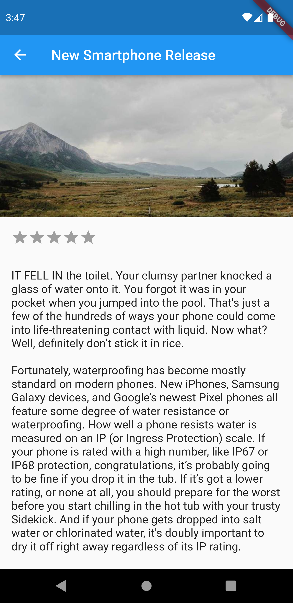

# protal_app

## Overview

This project is designed as a practical introduction to developing with Flutter, focusing on creating a news application. It showcases Flutter's capabilities for crafting beautiful, natively compiled applications from a single codebase for mobile, web, and desktop.


## หลักการทำงานของ App


## Folder Structure

```
lib/
|- components/           # Reusable UI components (e.g., NewsCard, Drawer)
|- Model/                # Data model classes
|- Pages/                # Screens/pages of the app (e.g., HomePage, LoginScreen)
|- services/             # Classes for handling external services (APIs)
|- utils/                # Utility functions or classes
|- viewmodel/            # View model classes for business logic
|- main.dart             # Entry point of the application
```

## Key Components

- **main.dart**: The starting point of the application, setting up the MaterialApp and the initial route.
- **components/**: Contains reusable UI components like `NewsCard` for displaying news articles and a custom `Drawer` for navigation.
- **Model/**: Defines the structure for the data used within the app, such as news articles.
- **Pages/**: Hosts the various screens of the application, including the home page, login screen, and details pages for news articles.
- **services/**: Includes services for fetching data from external sources, demonstrating how to integrate APIs.
- **utils/**: Utility classes or functions that provide common functionality throughout the app.
- **viewmodel/**: Contains the business logic of the application, separating the UI from the core logic.

## Getting Started

To get started with this project:

1. Ensure you have Flutter installed on your machine.
2. Clone this repository to your local machine.
3. Open a terminal in the project directory and run `flutter pub get` to install dependencies.
4. Run `flutter run` to start the app on a connected device or emulator.

## what's inside?

This is the project to show basic widget information about flutter application

- Splash Screen 

_ Login Form

-Form validation

-Fetching data from json file in card

- Showing news in details page and star logic implimented

- Suggestion Page

- Profile Page
